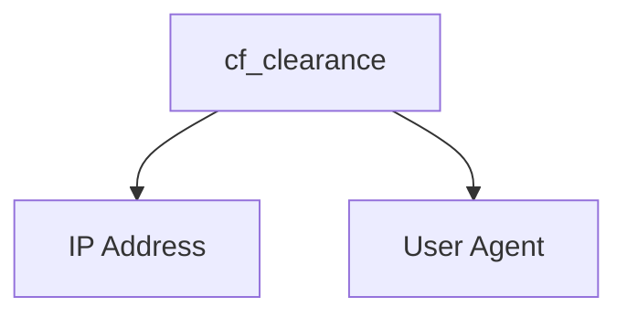

# CF-Clearance-Scraper

## nodriver Version
A simple program for scraping Cloudflare clearance (cf_clearance) cookies from websites issuing Cloudflare challenges to visitors. This program works on all Cloudflare challenge types (JavaScript, managed, and interactive).

## Clearance Cookie Usage
In order to bypass Cloudflare challenges with the clearance cookies, you must make sure of two things:

- The user agent used to fetch the clearance cookie must match the user agent being used within the requests that use the clearance cookie
> [!NOTE]
> The default user agent used by the scraper is `Mozilla/5.0 (Windows NT 10.0; Win64; x64) AppleWebKit/537.36 (KHTML, like Gecko) Chrome/130.0.0.0 Safari/537.36`.
- The IP address used to fetch the clearance cookie must match the IP address being used to make the requests that use the clearance cookie



## Installation
Download and install [Google Chrome](https://www.google.com/chrome/index.html).

Then, install the Python dependencies:

    $ pip install -r requirements.txt

## Usage
> [!WARNING]
> nodriver is currently detected by Cloudflare when using headless mode. You can pass the `-d` flag to run the browser in headed mode.

> [!NOTE]
> Depending on the user agent used, it may affect your ability to solve the Cloudflare challenge.

```
usage: main.py [-h] [-f FILE] [-t TIMEOUT] [-p PROXY] [-ua USER_AGENT] [--disable-http2] [-d] [-v] URL

A simple program for scraping Cloudflare clearance (cf_clearance) cookies from websites issuing Cloudflare challenges to visitors

positional arguments:
  URL                   The URL to scrape the Cloudflare clearance cookie from

options:
  -h, --help            show this help message and exit
  -f FILE, --file FILE  The file to write the Cloudflare clearance cookie information to, in JSON format
  -t TIMEOUT, --timeout TIMEOUT
                        The timeout in seconds to use for solving challenges
  -p PROXY, --proxy PROXY
                        The proxy server URL to use for the browser requests
  -ua USER_AGENT, --user-agent USER_AGENT
                        The user agent to use for the browser requests
  --disable-http2       Disable the usage of HTTP/2 for the browser requests
  -d, --debug           Run the browser in headed mode
  -v, --verbose         Increase the output verbosity
```

## Example
    $ python main.py -v -d -f cookies.json https://sergiodemo.com/security/challenge/managed-challenge
    [09:32:11] [INFO] Launching headed browser...
    [09:32:11] [INFO] Going to https://sergiodemo.com/security/challenge/managed-challenge...
    [09:32:12] [INFO] Solving Cloudflare challenge [Managed]...
    [09:32:13] [INFO] Cookie: cf_clearance=shROubfIW5fFY3MP57LHOHpgqTajEJmSf_OAOHzFCrE-1730212331-1.2.1.1-LMVnpv1XZrom_2aqroIEx3ENq.6_WWi_zreDw9tn.0iNbALJgnQUxNv8gzHe2UMRRH.Cj7cR6cadGpJJH4EgEH0cX8Zevv7bwiKL0ykxBf9muDt9Lu0UbNmxbqRW.RP2b6VIM6t5NfI0PtoeSThfvDIywWck6jQ99VRrbbSeKg46A53f4ctkNf8ZjTy_SRoh8e.imNrLC3CRV3l7FDaEan_JHUuf3wAbDDJ0l6pfv7mBYNqGNdyXTvRITcgUr7ZUyeyoXC5I8A9mmaM0jS3kHXXxBlXhlR1voLwAynuu25GQw7ycXQGK47QngJr33gdm7MQVUP5_6mmtNIqXY1Y6U3j0pHkksgbUj2BaoeiFraX.aegb6PgbQBDiYlq168P7MlLW1.Ew9.wJG.Hp6dgTEgv_FZq9kYa3lic4i8GZBkKbOAJC_WNOkrfKhDtGf6lS
    [09:32:13] [INFO] User agent: Mozilla/5.0 (Windows NT 10.0; Win64; x64) AppleWebKit/537.36 (KHTML, like Gecko) Chrome/130.0.0.0 Safari/537.36
    [09:32:13] [INFO] Writing Cloudflare clearance cookie information to cookies.json...
