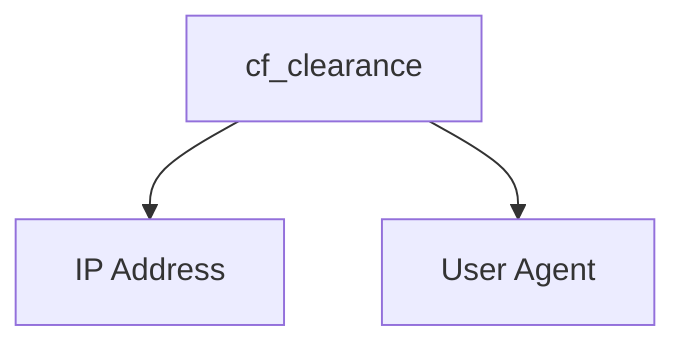

# CF-Clearance-Scraper

## nodriver Version
A simple program for scraping Cloudflare clearance (cf_clearance) cookies from websites issuing Cloudflare challenges to visitors. This program works on all Cloudflare challenge types (JavaScript, managed, and interactive). If you would prefer using Playwright, you can check out the [Playwright version](https://github.com/Xewdy444/CF-Clearance-Scraper/tree/playwright).


## Clearance Cookie Usage
In order to bypass Cloudflare challenges with the clearance cookies, you must make sure of two things:

- The user agent used to fetch the clearance cookie must match the user agent being used within the requests that use the clearance cookie
> [!NOTE]
> The default user agent used by the scraper is `Mozilla/5.0 (Windows NT 10.0; Win64; x64) AppleWebKit/537.36 (KHTML, like Gecko) Chrome/130.0.0.0 Safari/537.36`.
- The IP address used to fetch the clearance cookie must match the IP address being used to make the requests that use the clearance cookie



## Installation
Download and install [Google Chrome](https://www.google.com/chrome/index.html).

Then, install the Python dependencies:

    $ pip install -r requirements.txt

## Usage
> [!NOTE]
> Headless mode is not support on Windows.

> [!WARNING]
> Depending on the user agent used, it may affect your ability to solve the Cloudflare challenge.

```
usage: main.py [-h] [-f FILE] [-t TIMEOUT] [-p PROXY] [-ua USER_AGENT] [--disable-http2] [--disable-http3] [-d] [-v] URL

A simple program for scraping Cloudflare clearance (cf_clearance) cookies from websites issuing Cloudflare challenges to visitors

positional arguments:
  URL                   The URL to scrape the Cloudflare clearance cookie from

options:
  -h, --help            show this help message and exit
  -f FILE, --file FILE  The file to write the Cloudflare clearance cookie information to, in JSON format
  -t TIMEOUT, --timeout TIMEOUT
                        The timeout in seconds to use for solving challenges
  -p PROXY, --proxy PROXY
                        The proxy server URL to use for the browser requests
  -ua USER_AGENT, --user-agent USER_AGENT
                        The user agent to use for the browser requests
  --disable-http2       Disable the usage of HTTP/2 for the browser requests
  --disable-http3       Disable the usage of HTTP/3 for the browser requests
  -d, --debug           Run the browser in headed mode
  -v, --verbose         Increase the output verbosity
```

## Example
    $ python main.py -v -d -f cookies.json https://sergiodemo.com/security/challenge/legacy-challenge
    [14:14:44] [INFO] Launching headed browser...
    [14:14:44] [INFO] Going to https://sergiodemo.com/security/challenge/legacy-challenge...
    [14:14:45] [INFO] Solving Cloudflare challenge [Interactive]...
    [14:14:52] [INFO] Cookie: cf_clearance=7L.nyfi8LisynHl0JDliTWQpzszoniPFiJ6yu564FSI-1733516084-1.2.1.1-JXRIHIFfVwwg7t69xfJQrDEt7qbIqyDqOqA6z9TJcKgqVdBtpXCTAgSFGrkJtbYQhRJ7oPpuV7fnc3nQWLYF.DjWXRDnSw1eIgDXgk.YEvO4rPFoCzpFzRzLc7RHKheqRC6Wjra9XXyUlnsZYply5PBH2DkUdSC7xvMSBuvEZdVF5fZltP2IHnZy7qDLasySHtK767PCeBLLi48JyHaJMP0F4armNtdC2KESCTugb8j4zlZSmOZDKf.FkgYiFimyifWNpMTMoXv7Olyo5FSZf5dRPacV98gRwE2youzznSTfqEyyxLOSlGlkQQ48f1o.LusvnM4g1_G6HBfDuZQPagGuPUwaUo6CXa4UXjAUMi_cuzRVYc8TfR9Vr2I0fvPH.AbG2ZRcbCW8NTKiuWnVbCj1o6b6VrRvCeK8EZtpUGg
    [14:14:52] [INFO] User agent: Mozilla/5.0 (Windows NT 10.0; Win64; x64) AppleWebKit/537.36 (KHTML, like Gecko) Chrome/130.0.0.0 Safari/537.36
    [14:14:52] [INFO] Writing Cloudflare clearance cookie information to cookies.json...
