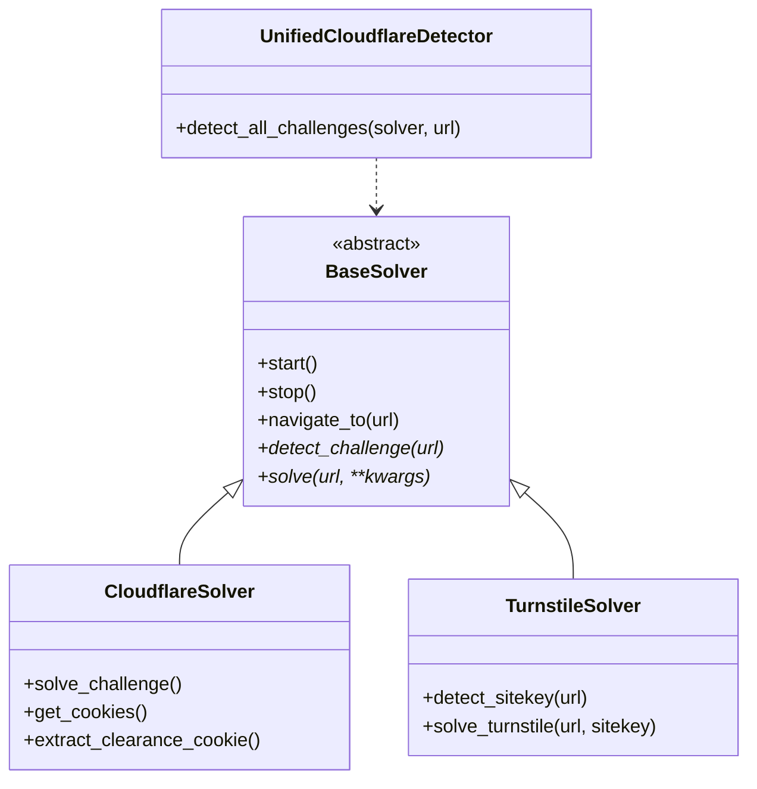

# CF-Clearance-Scraper v2.0 - Arquitectura Unificada

Una solución completa y modernizada para resolver desafíos de Cloudflare, incluyendo obtención de cookies de clearance y resolución de Turnstile CAPTCHA.

## 🆕 Novedades de la v2.0

### Arquitectura Unificada
- **`BaseSolver`**: Clase abstracta base que define la interfaz común para todos los solvers
- **`UnifiedCloudflareDetector`**: Detector universal que identifica todos los tipos de desafíos en una sola pasada
- **Interfaz Polimórfica**: Todos los solvers implementan los mismos métodos base (`detect_challenge`, `solve`)
- **Tipos Consistentes**: `ChallengeType`, `SolverMode` para mayor claridad
- **Resultados Estructurados**: `BaseResult`, `ClearanceResult`, `TurnstileResult` con información completa

### Mejoras de Mantenibilidad
- **Separación de Responsabilidades**: Cada solver se enfoca en su tipo específico de desafío
- **Código Reutilizable**: Funcionalidades comunes en la clase base
- **Extensibilidad**: Fácil agregar nuevos tipos de solvers
- **Compatibilidad**: Las APIs v1.x siguen funcionando

## Funcionalidades

### 🛡️ CF-Clearance (Cookies de Clearance)
- Resolución automática de desafíos de Cloudflare (JavaScript, Managed, Interactive)
- Obtención de cookies `cf_clearance` requeridas
- Soporte para proxies autenticados
- User agents realistas con metadatos completos
- Generación de comandos HTTP (curl, wget, aria2)

### 🔄 Turnstile Solver (CAPTCHA)
- Detección automática de sitekey en páginas web
- Modo manual para sitekeys conocidos
- Resolución automática de desafíos de Turnstile
- Soporte para parámetros `action` y `cdata`
- Timeouts configurables

### 🌐 APIs e Interfaces
- Interfaz de línea de comandos (CLI) mejorada
- API REST completa con documentación OpenAPI
- Detección unificada de múltiples tipos de desafíos
- Almacenamiento persistente de resultados

## Instalación

```bash
# Instalar dependencias
pip install -r requirements.txt

# O instalar como paquete
pip install -e .
```

## Uso Rápido

### Arquitectura Unificada

```python
import asyncio
from cf_clearance_scraper import CloudflareSolver, TurnstileSolver, UnifiedCloudflareDetector

async def ejemplo_unificado():
    # Detectar todos los tipos de desafíos
    async with CloudflareSolver() as solver:
        challenges = await UnifiedCloudflareDetector.detect_all_challenges(
            solver, "https://sslrenewals.com/checkout.aspx"
        )
        print(f"Desafíos encontrados: {challenges['challenges_found']}")
    
    # Resolver clearance con nueva interfaz
    async with CloudflareSolver() as solver:
        result = await solver.solve("https://protected-site.com")
        if result.success:
            print(f"Cookie obtenida: {result.clearance_cookie['value']}")
    
    # Resolver Turnstile con auto-detección
    async with TurnstileSolver() as solver:
        result = await solver.solve("https://turnstile-site.com")
        if result.success:
            print(f"Token obtenido: {result.token}")

asyncio.run(ejemplo_unificado())
```

### Uso Tradicional (Compatibilidad v1.x)

```python
# CloudflareSolver (modo tradicional)
async with CloudflareSolver() as solver:
    await solver.navigate_to("https://sslrenewals.com/checkout.aspx")
    cookies = await solver.get_cookies()
    clearance = solver.extract_clearance_cookie(cookies)

# TurnstileSolver (modo tradicional) 
async with TurnstileSolver() as solver:
    result = await solver.solve_turnstile("https://sslrenewals.com/checkout.aspx")
```

### CLI

```bash
# Obtener clearance cookie
python main.py https://protected-site.com --file cookies.json

# Resolver Turnstile (auto-detección)
python -m cf_clearance_scraper.api.models --turnstile https://turnstile-site.com

# Modo API
python api_server.py --host 127.0.0.1 --port 8000
```

## API REST

### Endpoints Principales

```bash
# Health check
GET /health

# Clearance tradicional
POST /scrape
{
  "url": "https://protected-site.com",
  "timeout": 30,
  "headless": true
}

# Turnstile auto-detección
POST /turnstile
{
  "url": "https://turnstile-site.com",
  "mode": "auto_detect"
}

# Detección de sitekey
POST /turnstile/detect
{
  "url": "https://turnstile-site.com"
}
```

### Ejemplos de Respuesta

```json
// Clearance Response
{
  "success": true,
  "challenge_type": "managed",
  "clearance_cookie": {"name": "cf_clearance", "value": "abc123..."},
  "processing_time": 12.3,
  "challenge_detected": true
}

// Turnstile Response  
{
  "success": true,
  "challenge_type": "turnstile",
  "token": "0.ABC123...",
  "sitekey": "0x4AAAAAAABs8...",
  "processing_time": 8.7
}
```

## Arquitectura de Clases



## Tipos de Datos

```python
from cf_clearance_scraper import ChallengeType, SolverMode

# Tipos de desafío
ChallengeType.JAVASCRIPT    # Desafío no interactivo
ChallengeType.MANAGED       # Desafío gestionado  
ChallengeType.INTERACTIVE   # Desafío interactivo
ChallengeType.TURNSTILE     # CAPTCHA Turnstile

# Modos de solver
SolverMode.AUTO_DETECT      # Detección automática
SolverMode.MANUAL           # Sitekey manual
```

## Migración desde v1.x

La v2.0 mantiene **compatibilidad completa** con las APIs v1.x. Para aprovechar las nuevas funcionalidades:

### Cambios Recomendados

```python
# v1.x - Estilo tradicional
async with CloudflareSolver() as solver:
    await solver.navigate_to(url)
    challenge = await solver.detect_challenge()
    success = await solver.solve_challenge()

# v2.0 - Estilo unificado (recomendado)
async with CloudflareSolver() as solver:
    result = await solver.solve(url)
    # result contiene toda la información
```

### Imports Actualizados

```python
# v2.0 - Imports desde el módulo principal
from cf_clearance_scraper import (
    BaseSolver,           # Nuevo
    ChallengeType,        # Nuevo (reemplaza ChallengePlatform)
    CloudflareSolver,     # Actualizado
    TurnstileSolver,      # Actualizado
    UnifiedCloudflareDetector,  # Nuevo
)

# Compatibilidad v1.x todavía disponible
from cf_clearance_scraper import ChallengePlatform, TurnstileMode
```

## Ejemplos Avanzados

Ver `example_unified_solver.py` para demostraciones completas de:
- Detección unificada de desafíos
- Uso polimórfico de solvers
- Manejo de errores y timeouts
- Integración con APIs externas

## Licencia

MIT License - Ver `LICENSE` para más detalles.

## Contribuciones

Las contribuciones son bienvenidas. Por favor, mantén la compatibilidad hacia atrás y sigue los patrones de la arquitectura unificada.
